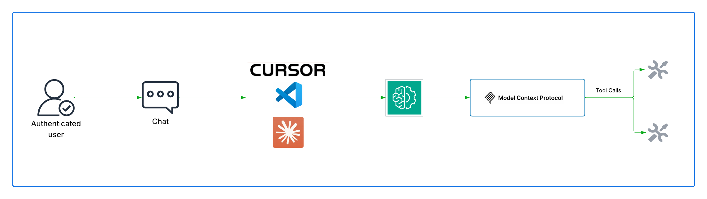
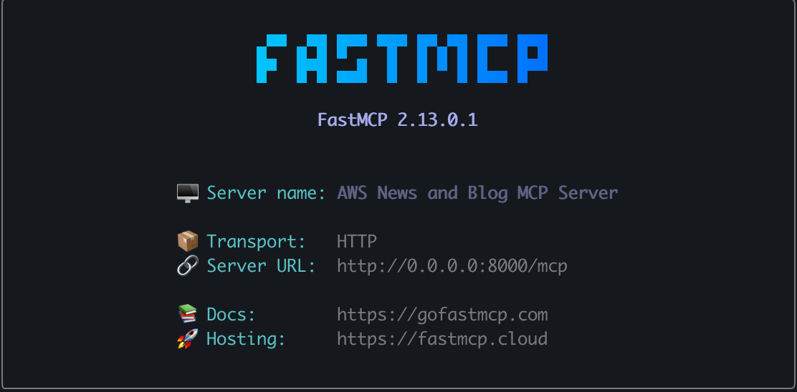

# AWS News MCP Server

> Enable your LLMs to access real-time AWS news, announcements, and blog posts through the Model Context Protocol (MCP).



## 🎯 What is This?

This repository contains **MCP (Model Context Protocol) servers** that allow AI assistants like Claude, ChatGPT, or any MCP-compatible LLM to fetch and analyze AWS news, feature announcements, and blog posts in real-time. Instead of relying on outdated training data, your AI can now access the latest AWS updates directly.

### Why Use This?

- 🚀 **Real-Time AWS Updates**: Get the latest AWS announcements as they happen
- 🤖 **AI-Native Integration**: Built specifically for LLM consumption via MCP
- 🎯 **Flexible Filtering**: Search by service, date, content type, and regions
- 📡 **Multiple Data Sources**: Access both AWS API and official RSS feeds
- 🛠️ **Developer-Friendly**: Easy to integrate with any MCP-compatible client
- ✅ **Production Ready**: Fully tested with comprehensive test suite

## 📦 What's Inside

This repository contains multiple MCP server implementations:

### 1. **Streamable HTTP Server** (Available Now)
A production-ready FastMCP server with HTTP transport that provides:
- ✅ 2 Tools: `get_aws_news` and `get_aws_feed_news`
- ✅ 10 Prompts: Pre-built templates for common queries
- ✅ Health checks and monitoring
- ✅ Docker support
- ✅ Comprehensive test suite

📖 **[View detailed documentation →](streamable-HTTP-server/README.md)**

### 2. **Studio Server** (Coming Soon)
An enhanced MCP server implementation with additional features for Claude Desktop and other MCP clients.

## 🚀 Quick Start

### Prerequisites

- Python 3.10 or higher
- pip or uv package manager

### Installation

```bash
# Clone the repository
git clone https://github.com/yourusername/aws-news-mcp.git
cd aws-news-mcp

# Navigate to the HTTP server
cd streamable-HTTP-server

# Create virtual environment
python3 -m venv .venv
source .venv/bin/activate

# Install dependencies
pip install -r requirements.txt

# Run the server
python main.py
```



Server will start on `http://0.0.0.0:8000`

### Using with Docker

```bash
cd streamable-HTTP-server
docker build -t aws-news-mcp .
docker run -p 8000:8000 aws-news-mcp
```

## 🔧 Usage Examples

Once the server is running, you can connect your MCP-compatible LLM client to use the tools:

### Example 1: Get Recent Lambda Updates
```python
# Using the get_aws_news tool
{
  "topic": "lambda",
  "news_type": "all",
  "since_date": "2025-01-01T00:00:00Z"
}
```

### Example 2: Get Latest AWS Announcements from Feed
```python
# Using the get_aws_feed_news tool
{
  "max_articles": 10,
  "search_keywords": "ec2"
}
```

### Example 3: Using Prompts
Your LLM can use pre-built prompts for common queries:
- "What's new with Lambda?" → Uses `aws_recent_updates` prompt
- "Show me S3 blogs" → Uses `aws_latest_blogs` prompt
- "Breaking AWS news" → Uses `aws_breaking_news` prompt

## 🏗️ Architecture

The MCP server architecture follows the Model Context Protocol specification:

```
┌─────────────────┐
│   LLM Client    │  (Claude, ChatGPT, etc.)
│  (MCP Client)   │
└────────┬────────┘
         │ MCP Protocol
         │
┌────────▼────────┐
│   AWS News MCP  │  (This Server)
│     Server      │
└────────┬────────┘
         │
    ┌────┴────┐
    │         │
┌───▼───┐ ┌──▼──────┐
│AWS API│ │AWS Feed │
└───────┘ └─────────┘
```

The server acts as a bridge between LLMs and AWS news sources, providing:
1. **Tools**: Functions that LLMs can call to fetch data
2. **Prompts**: Template queries that help LLMs understand what to ask
3. **Resources**: Structured data returned in LLM-friendly formats

## 🔌 MCP Client Configuration

### For Claude Desktop

Add to your `claude_desktop_config.json`:

```json
{
  "mcpServers": {
    "aws-news": {
      "command": "python",
      "args": ["/path/to/aws-news-mcp/streamable-HTTP-server/main.py"],
      "env": {}
    }
  }
}
```

### For Cursor / Other MCP Clients

Add to your MCP configuration:

```json
{
  "mcpServers": {
    "aws-news": {
      "url": "http://localhost:8000"
    }
  }
}
```

## 📚 Available Tools

### `get_aws_news`
Fetch AWS news and blogs with flexible filtering from the AWS API.

**Parameters:**
- `topic` (required): AWS service name (e.g., "lambda", "s3", "ec2")
- `news_type` (optional): "all", "news", or "blogs"
- `since_date` (optional): ISO 8601 date string
- `include_regional_expansions` (optional): Include regional expansion news
- `number_of_results` (optional): Max results to return (default: 40)

### `get_aws_feed_news`
Get real-time updates from the official AWS What's New RSS feed.

**Parameters:**
- `max_articles` (optional): Number of articles to return (default: 10)
- `search_keywords` (optional): Filter by keywords

## 🎨 Available Prompts

The server provides 10 pre-built prompt templates:

1. **aws_recent_updates** - Get recent updates for any service
2. **aws_latest_blogs** - Get blog posts only
3. **aws_latest_announcements** - Get official announcements only
4. **aws_regional_expansions** - Find regional expansion news
5. **aws_whats_new_today** - Today's AWS updates
6. **aws_weekly_digest** - Weekly summary
7. **aws_comprehensive_search** - Deep dive into a service
8. **aws_latest_feed_updates** - Latest from RSS feed
9. **aws_feed_service_updates** - Service-specific feed updates
10. **aws_breaking_news** - Top 5 most recent announcements

## 🧪 Testing

```bash
cd streamable-HTTP-server

# Run all tests
python -m pytest tests/ -v

# Run with coverage
python -m pytest tests/ --cov=. --cov-report=html

# Test health endpoint
curl http://localhost:8000/health
```

**Test Coverage:**
- ✅ 9 total tests passing
- ✅ API functionality tests
- ✅ Prompt template tests
- ✅ Error handling tests

## 📁 Repository Structure

```
aws-news-mcp/
├── assets/
│   ├── mcp.png           # MCP architecture diagram
│   └── image.png         # Server startup screenshot
├── streamable-HTTP-server/
│   ├── main.py           # Main server implementation
│   ├── promptz.py        # Prompt templates
│   ├── requirements.txt  # Python dependencies
│   ├── Dockerfile        # Container configuration
│   ├── README.md         # Detailed documentation
│   └── tests/            # Test suite
├── studio-server/        # Coming soon
├── LICENSE
└── README.md             # This file
```

## 🌟 Use Cases

- 📰 **Stay Updated**: Monitor specific AWS services for new features
- 🤖 **AI Research Assistant**: Let your LLM answer AWS-related questions with current data
- 📊 **Competitive Analysis**: Track AWS product releases and capabilities
- 📧 **Newsletter Generation**: Gather AWS updates for weekly digests
- 🎓 **Learning**: Discover new AWS features and best practices
- 🌍 **Regional Planning**: Track service availability across AWS regions

## 🔗 Data Sources

This server fetches data from:

1. **AWS News API** (`https://api.aws-news.com`)
   - Structured JSON data
   - Advanced filtering capabilities
   - Historical data access

2. **AWS What's New RSS Feed** (`https://aws.amazon.com/about-aws/whats-new/recent/feed/`)
   - Real-time announcements
   - Official AWS source
   - Breaking news access

## 🛠️ Development

### Adding New Features

1. Fork the repository
2. Create a feature branch
3. Add your changes with tests
4. Ensure all tests pass
5. Submit a pull request

### Project Dependencies

- `fastmcp>=2.13.0.1` - MCP framework
- `httpx>=0.28.1` - HTTP client
- `uvicorn>=0.38.0` - ASGI server
- `fastapi>=0.120.0` - Web framework
- `pytest>=8.3.4` - Testing

## 📖 Learn More

- **[Streamable HTTP Server Documentation](streamable-HTTP-server/README.md)** - Detailed API reference
- **[Model Context Protocol](https://modelcontextprotocol.io/)** - MCP specification
- **[FastMCP](https://github.com/jlowin/fastmcp)** - MCP framework used
- **[AWS What's New](https://aws.amazon.com/new/)** - AWS announcements page

## 🤝 Contributing

Contributions are welcome! Please:

1. Ensure all tests pass
2. Follow existing code style
3. Add tests for new features
4. Update documentation
5. Submit detailed pull requests

## 📄 License

See [LICENSE](LICENSE) file for details.

## 🙏 Acknowledgments

- Built with [FastMCP](https://github.com/jlowin/fastmcp)
- Data from AWS News API and AWS official feeds
- Inspired by the Model Context Protocol community

---

**Questions?** Open an issue or submit a pull request!


