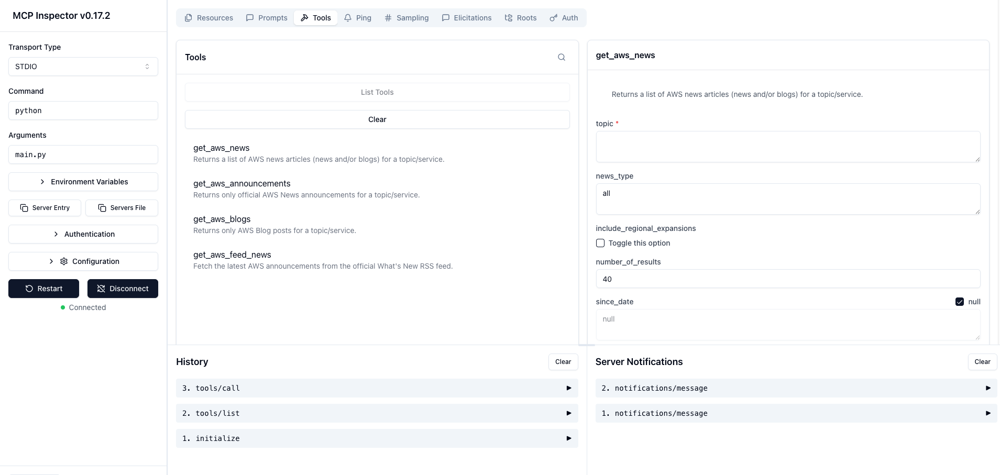

## How to Test this studio Server in MCP Inspector locally

- Clone the repository
```
git clone https://github.com/yourusername/aws-news-mcp.git
cd aws-news-mcp/studio
# create venv
python -m venv .venv
# install dependencies
pip install -r requirements.txt
```
- Install Inspector
```
npx @modelcontextprotocol/inspector
```

- Run Inspector pointing to your MCP server directly:
```
npx @modelcontextprotocol/inspector python main.py
```


### How to use this studio MCP Server locally in your local IDE(Claude or Cursor)
MCP clients do NOT manage Python environments for you. They simply run the command you specify in mcp.json.

That means:

If your tool is inside a venv,And your MCP client launches the server using system python, Your server(IDE) will have issue because the required packages won’t be found.
So you must tell the MCP client which Python to run.

```
{
    "mcpServers": {
      "aws-news": {
        "command": "/absolute/path/to/project/.venv/bin/python",
        "args": ["/absolute/path/to/project/main.py"],
        "transport": "stdio"
      }
    }
  }
```

#### How to test your MCP server with the venv

```
npx @modelcontextprotocol/inspector /path/to/venv/bin/python aws-news-mcp-server.py

```
### Pro Tip: Use a shell wrapper script
create a script and use it

```
#!/bin/bash
source /absolute/path/to/project/venv/bin/activate
exec /absolute/path/to/project/venv/bin/python /absolute/path/to/project/aws-news-mcp-server.py
```
update `mcp.json`
```
{
    "mcpServers": {
      "aws-news": {
        "command": "/absolute/path/to/project/wrapper.sh",
        "transport": "stdio"
      }
    }
}
```


## Note
| Question                               | Answer                                                                           |
| -------------------------------------- | -------------------------------------------------------------------------------- |
| How does MCP use my venv?              | It *won’t*, unless you explicitly point the MCP `command` to your venv’s Python. |
| Where do installed packages come from? | From whatever Python interpreter the MCP client launches.                        |
| What should I put in mcp.json?         | The full path to your venv’s Python binary.                                      |
